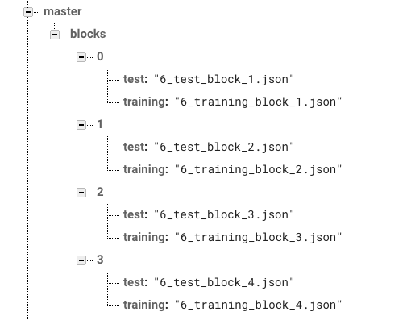

# Word Learning Experiment

## Introduction
- This web application presents images and sound files to a participant. The experiment is several sets of training and test blocks that are presented to a participant.

### Training block
- A a single image is presented and a wav file plays.
- Participant presses spacebar to proceed through all items.
- Items presented to participant are listed in the test_block.json file in /public/lists.

### Test block
- Participant is presented with two images for a brief period followed by red square.
- Participant presses the spacebar to hear the accompanying wav file.
- Participant responds by pressing either "z" (left picture) or "m" (right picture) on the keyboard .
- Items presented to participant are listed in the training_block.json file in /public/lists.

## Setup
- Download or clone repo.
- Run npm install.
```
npm install
```
- Get firebase [config file](https://firebase.google.com/docs/web/setup#add-sdks-initialize) and save as firebase.config.json in /public folder.
- See /public/firebase.config.demo.json for an example of what the config file should look like.

### Prolific
- If using Prolific, make sure Firebase RealTime database is active and the desired json list block declared under master/blocks/
- 
- Create config.json in /public folder and set to
```
    {
        "platform": "prolific",
        "prolificCompletionUrl": "YOUR_STUDY_COMPLETION_URL_HERE"
    }
```
- See /public/config.prolific.json for an example of what this should look like

### Sona
- If using Sona, json list blocks are declared in /public/config.json and selected via URL parameters
- Make a copy of /public/config.sona.json and renamed to config.json
- Modify config.json, add completion URLs for each list group 
- Include the URL "listGroup" URL parameter in the experiment URL, for example:
    - https://mystudy.web.app/#/?PROLIFIC_PID=123&listGroup=1a
- 1a references "group1a" in the listGroup section of the config.json file
- Replace "123" in the above URL with %SURVEY_CODE% in Sona

## Development
```
npm run serve
```

### Production
```
npm run build
```


